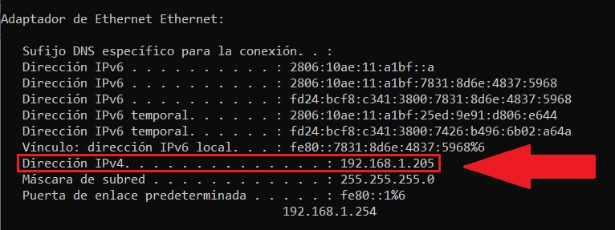
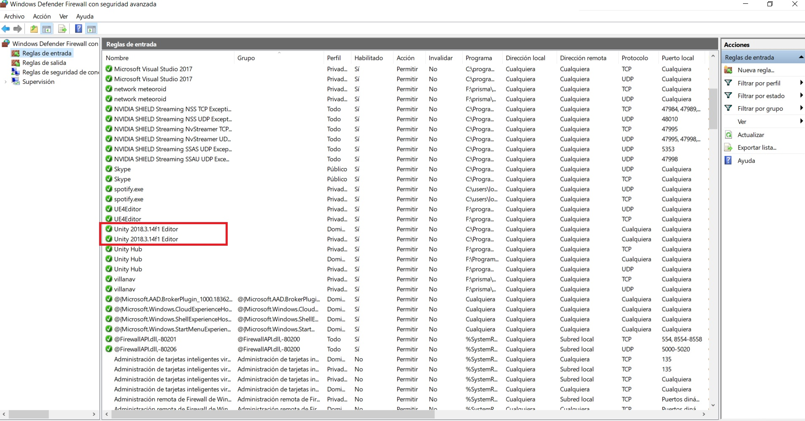

# Villa-Iluminada

Esta compuesto por 2 escenas, la escena del Lobby y la escena donde se renderea el video 360°.

Al iniciar la aplicación el administrador es capaz de iniciar un Servidor local como Host, todos los demas dispositivios tienen la posibilidad de unirse a esa partida a partir de que esten conectados en la misma red LAN - wifi. Para conocer la direccion ip del dispositivo local:

  * Abrir Inicio
  * Escribe: 'cmd'
  * Al abrir la consola teclea: 'ipconfig'
  * Copia la direccion IPV4 en el apartado Unirse y pulsa el boton 'GO'

Al entrar al lobby el cliente automaticamente entra en modo 'READY', es decir ya esta listo para comenzar la experiencia.

Por ultimo una vez que todos los dispositivos hayan entrado a la sala, el 'Host' iniciara la experiencia al dar click al boton 'JOIN'  
  
  
  
  Nota: Unity bloque por default ciertas caracteristicas de Firewall, si no es posible conectar al host probablemente es por esta razón, para solucionarlo:
  
  * Abrir Inicio
  * Escribe 'firewall con seguridad avanzada'
  * Abre 'Windows defender firewall con seguridad avanzada'
  * En "reglas de entrada" buscar en la lista la seccion de Unity y verifica que todas las casillas esten habilitadas con icono de check verde, si hay alguna bloqueada activaladandole doble click -> General -> Accion -> Permitir conexión. Aplicar y aceptar.

